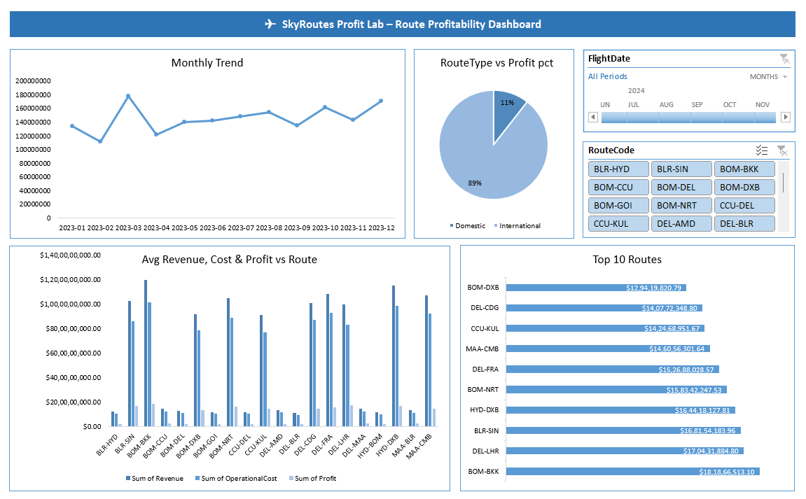

# ✈️ SkyRoutes Profit Lab — Route Profitability Dashboard


> 📊 **A complete SQL + Excel analytics project analysing 5,000 airline flight records to uncover route profitability, occupancy trends, and operational efficiency.**


---

## 📁 Project Structure

```
SkyRoutesProfitLab/
│
├── 📄 AirlineRoutesData.csv          # Raw dataset — 5,000 flight records
├── 🗄️ SkyRoutesAnalysis.sql          # MySQL queries for all analysis
├── 📊 RouteProfitDashboard.xlsx       # Excel dashboard with charts & pivot tables
├── 📋 RouteInsights.txt              # Written insights & business recommendations
└── 📖 README.md                      # Project documentation (this file)
```

---

## 🗃️ Dataset Overview

| Field | Description |
|---|---|
| `FlightID` | Unique identifier for each flight |
| `RouteCode` | Origin–Destination code (e.g., BOM-DEL) |
| `Origin` | Departure airport code |
| `Destination` | Arrival airport code |
| `FlightDate` | Date of flight (DD-MM-YYYY) |
| `FlightDurationMins` | Total flight duration in minutes |
| `AircraftType` | Aircraft model used |
| `SeatsAvailable` | Total seats on the flight |
| `SeatsSold` | Number of seats sold |
| `Revenue` | Total revenue generated (₹) |
| `OperationalCost` | Total operating cost (₹) |

- **Total Records:** 5,000 flights
- **Routes Covered:** 20 unique routes
- **Period:** January 2023 – December 2023
- **Route Types:** Domestic & International

---

## 🗄️ SQL Analysis — Queries Included

All queries are in `SkyRoutesAnalysis.sql` and run on **MySQL Workbench**.

| # | Query | Purpose |
|---|---|---|
| 1 | Top 10 Most Frequent Routes | Identify busiest routes by flight count |
| 2 | Avg Revenue, Cost & Profit per Route | Compare financial performance across routes |
| 3 | Underperforming Routes | Flag routes where avg profit < 0 |
| 4 | Seat Occupancy % per Route | Measure capacity utilisation |
| 5 | Monthly Profit Trend | Spot seasonal demand patterns |
| 6 | Domestic vs International Profitability | Compare route-type economics |
| 7 | Revenue per Minute of Flight | Rank routes by time-adjusted efficiency |

### 🔧 How to Run

```sql
-- Step 1: Create & use the database
CREATE DATABASE SkyRoutesAnalysis;
USE SkyRoutesAnalysis;

-- Step 2: Create table and import CSV via MySQL Workbench
-- (Table Wizard → Import AirlineRoutesData.csv)

-- Step 3: Run individual queries from SkyRoutesAnalysis.sql
```

---

## 📊 Excel Dashboard — RouteProfitDashboard.xlsx

The dashboard contains **4 interactive visualisations** built from pivot tables:

| Visual | Type | Description |
|---|---|---|
| 📈 Monthly Trend | Line Chart | Total profit by month (Jan–Dec 2023) |
| 🥧 RouteType vs Profit % | Pie Chart | Domestic vs International profit share |
| 📊 Avg Revenue, Cost & Profit vs Route | Clustered Bar | Side-by-side comparison for all 20 routes |
| 🏆 Top 10 Routes | Horizontal Bar | Ranked by total profit |

**Slicers available:** FlightDate (month filter) · RouteCode (route filter)

---

## 🖥️ Dashboard Preview



> *Interactive Excel dashboard with slicers for FlightDate and RouteCode filtering.*

---

## 💡 Key Insights

### 🌐 Overall Network Health
- **Total Profit (2023):** ₹1,73,82,57,552
- **Average Seat Occupancy:** 71.2%
- **Negative-profit routes:** 0 — all routes are operationally viable

### 🏅 Top Performer
**BOM-BKK** is the single most profitable route by total profit, driven by strong occupancy and a favourable revenue-to-cost ratio.

### ⚠️ Underperformer
**CCU-DEL** records the lowest average profit margin. Operational costs frequently approach revenue levels, suggesting a need for dynamic pricing or schedule optimisation.

### 🌍 Domestic vs International
| Metric | Domestic | International |
|---|---|---|
| Avg Profit / Flight | ₹72,989 | ₹6,25,853 |
| Total Flights | 2,516 | 2,484 |

> International routes deliver **757% higher** unit profit, confirming long-haul economics outperform domestic, despite higher costs.

### 📅 Seasonal Trends
- **Peak months:** October – December (Q4)
- **Dip period:** Mid-year (May – August)
- Recommendation: Increase capacity in Q4; run promotional fares in low-demand months

### ✈️ Aircraft Efficiency
| Aircraft | Best Use |
|---|---|
| Boeing 777 | Long-haul international — highest profit contribution |
| Airbus A380 | Long-haul international — strong load factors |
| ATR 72 | Short domestic routes — profitable only on low-cost legs |

---

## 🛠️ Tools Used

| Tool | Purpose |
|---|---|
|  | Data storage & SQL queries |
|  | Pivot tables, charts, slicers |
|  | Raw flight data source |

---

## 🚀 How to Reproduce

1. **Clone / download** all project files
2. Open **MySQL Workbench** → run `SkyRoutesAnalysis.sql` to create the database and import the CSV
3. Execute each query section to generate result sets
4. Open **RouteProfitDashboard.xlsx** in Excel to interact with the dashboard
5. Use the **FlightDate** and **RouteCode** slicers to filter views

---

## 📌 Notes

- The "Underperforming Routes" query returns an **empty set** — no route in this dataset has a negative average profit. This is documented in the SQL file.
- All monetary values are in **Indian Rupees (₹)**.
- FlightDate in the raw CSV is stored as `DD-MM-YYYY`; the SQL uses `STR_TO_DATE` for correct parsing.

---

<br>

---

*Made with ❤️ and data · SkyRoutes Profit Lab · 2023*

[](https://github.com/)
